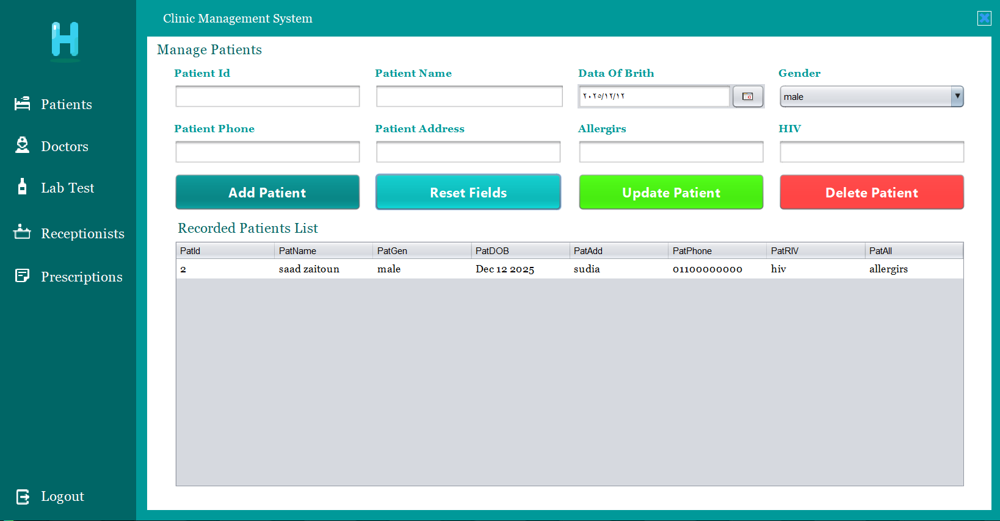

# 🏥 Clinic Management System  
### Java Desktop Application (Swing + MySQL)

  
  
  
  
  

---

## ✨ Overview  
The **Clinic Management System** is a complete desktop application built using **Java Swing** and **MySQL**, designed to streamline and automate daily clinic operations.  
It provides a centralized interface for managing **patients, doctors, prescriptions, lab tests, and receptionists**, supported by a secure **login system** and organized workflow.

The application is built with **clean MVC architecture**, smooth navigation, and a fully responsive desktop layout.

---

## 🧩 Key Modules  

### 🔐 Login System
- Secure authentication  
- Encrypted passwords  

### 👥 Patients Management
- Add, update, and delete patient records  
- Complete patient profile and medical history  
- Fast search (ID, name, phone…)  

### 🩺 Doctors Management
- Manage doctors and specialties  
- View doctor–patient interactions  

### 💊 Prescriptions
- Create and manage prescriptions  
- Add medicines, dosage, instructions  
- Automatically linked to patient profile  

### 🧑‍💼 Receptionists Management
- Manage receptionist accounts  
- Simple user-friendly interface  

### 🔬 Test Laboratory
- Add and manage lab test results  
- Assign tests to patients & doctors  
- Store full lab history  

---

## 🔗 Screenshots

  
  
  
  
  
  

---

## 👤 Developer

Abdallah Zaitoun
- 📧 Email: abdallahzaytoon42@gmail.com
- 🔗 LinkedIn: Abdallah Zaitoun
